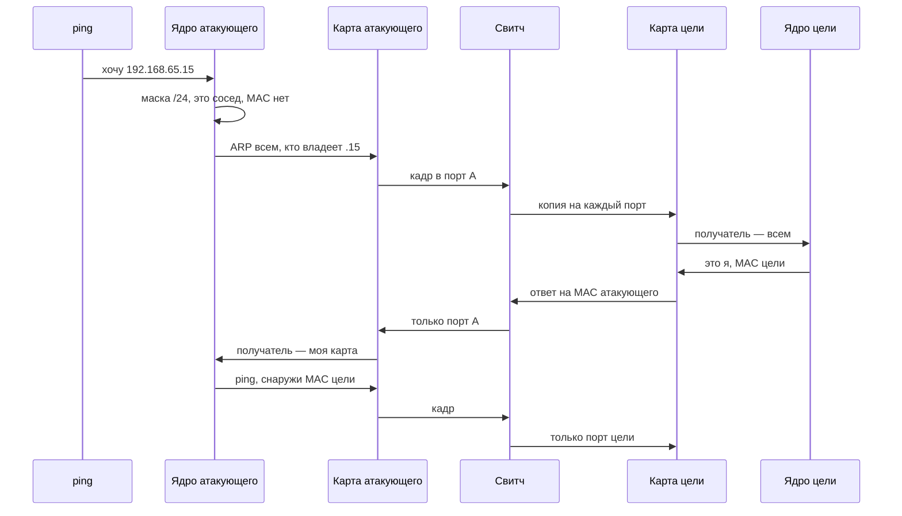
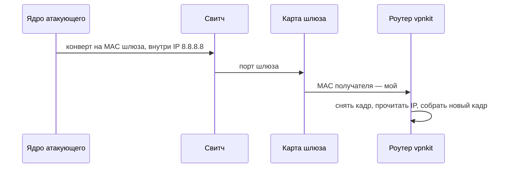

# Как передаётся кадр

Шаг за шагом: кто собирает кадр, кто его несёт и где он заканчивается. Адреса лаборатории: атакующий `192.168.65.14` / `aa:77:fb:2e:e0:ed`, цель `192.168.65.15` / `aa:77:fb:2e:e0:aa`, шлюз `192.168.65.1`. У обеих виртуалок карта называется `enp0s1`.

---

## Содержание

1. [Короткий ответ](#1-короткий-ответ)
2. [Кто стоит на пути](#2-кто-стоит-на-пути)
3. [Из чего состоит кадр](#3-из-чего-состоит-кадр)
4. [Две машины и свитч](#4-две-машины-и-свитч)
5. [Ping соседу, первый раз](#5-ping-соседу-первый-раз)
6. [Что свитч запоминает по дороге](#6-что-свитч-запоминает-по-дороге)
7. [Второй ping](#7-второй-ping)
8. [Ping в интернет](#8-ping-в-интернет)
9. [Если бы вместо свитча был хаб](#9-если-бы-вместо-свитча-был-хаб)
10. [Где здесь мост](#10-где-здесь-мост)
11. [Где в этих шагах ft_malcolm](#11-где-в-этих-шагах-ft_malcolm)
12. [Как увидеть](#12-как-увидеть)
13. [Связанные документы](#13-связанные-документы)

---

## 1. Короткий ответ

Кадр — это конверт. Машина решает, кому писать, и собирает его. Сетевая карта кладёт конверт в свой порт. Свитч смотрит MAC получателя на конверте и выбирает порт. Роутер конверт снимает, читает IP внутри и собирает новый конверт уже для другой сети.

Пока кадр идёт от атакующего к цели, IP и MAC едут вместе. Снаружи MAC карты, внутри IP компьютера. Свитч читает только наружную сторону.

---

## 2. Кто стоит на пути

Один и тот же кусок пути называют разными словами. Ниже каждый делает свою работу.

**Хост, или машина.** Компьютер, у которого есть адрес и который сам отправляет и принимает кадры. В лаборатории это виртуалка атакующего и виртуалка цели. Внутри машины живёт ядро. Ядро смотрит IP, маску и таблицу «IP → MAC». Потом отдаёт готовый кадр карте.

**L3.** Вопрос «какой компьютер». Ответ — IP, четыре числа. У цели это `192.168.65.15`. Этот уровень решает, сосед это или чужая сеть. Соседу кадр уходит напрямую. Чужой адрес уходит на шлюз.

**L2.** Вопрос «какая карта на этом свитче». Ответ — MAC, шесть байт. У цели это `aa:77:fb:2e:e0:aa`. Свитч и карта читают его. IP на этом шаге никому не нужен.

**Карта.** Край машины. У виртуалок это `enp0s1`, отдельной платы нет: карту рисует гипервизор. У карты один MAC. Она выкладывает кадр в единственный порт, к которому подключена. Принимает кадр, если MAC получателя совпал с её собственным или равен `ff:ff:ff:ff:ff:ff` («всем»). Чужой одиночный MAC она выбрасывает, до ядра он не доходит.

**Хаб.** Старая коробка на несколько портов. Она повторяет каждый бит во все порты и не смотрит адреса. Все карты слышат все кадры. В лаборатории хаба нет.

**Мост.** Несколько портов и таблица «этот MAC сидит за этим портом». Кадр на известный MAC уходит в один порт. Кадр «всем» уходит во все порты.

**Свитч.** Тот же мост, только портов много. IP, ping и ARP-записку он не читает. В лаборатории свитч виртуальный: к нему подключены атакующий, цель, шлюз и служебная машина Docker.

**Роутер.** Машина на границе двух сетей. Он принимает кадр своей картой, снимает конверт, смотрит IP и собирает новый кадр в другую сеть. Другие MAC, тот же IP внутри. Шлюз лаборатории `192.168.65.1` — это vpnkit, программа Docker на стороне Mac.

Домашний «роутер» обычно сразу три вещи: свитч на LAN-портах, Wi-Fi и роутер в сторону провайдера. Пока кадр гуляет между домашними компьютерами, работает свитч. Роутер включается, когда адрес лежит в другой сети.

---

## 3. Из чего состоит кадр

У ping соседу на проводе два слоя, один в другом.

```
конверт, L2, его читают карта и свитч
  получатель  aa:77:fb:2e:e0:aa     MAC цели
  отправитель aa:77:fb:2e:e0:ed     MAC атакующего
  тип         0x0800                внутри IPv4

письмо, L3, его читает ядро
  получатель  192.168.65.15
  отправитель 192.168.65.14
```

Тип `0x0806` значит: внутри не ping, а записка ARP. В ней тоже есть IP, но это вопрос «какой у тебя MAC?» или ответ на него. Длина такой записки вместе с конвертом — 42 байта.

Карта на проводе добивает короткий кадр пустыми байтами до минимальной длины и считает контрольную сумму. Программа эти байты обычно уже не видит.

---

## 4. Две машины и свитч

Обе виртуалки стоят на одном виртуальном свитче, сеть `192.168.65.0/24`.

```
атакующий                         свитч                         цель
enp0s1                            порт A                        enp0s1
192.168.65.14                     порт B                        192.168.65.15
aa:77:fb:2e:e0:ed                 порт шлюза .1                aa:77:fb:2e:e0:aa
                                  порт служебной VM Docker
```

Mac в эту схему не входит. Его `bridge100` — другой мост, сеть `192.168.64.0/24`. Кадр с порта A туда сам не переходит.

---

## 5. Ping соседу, первый раз

Атакующий выполняет `ping -c 1 192.168.65.15`. Таблица `ip neigh` пустая: MAC цели ядро ещё не знает. Сначала уходит вопрос, потом сам ping.



1. Программа `ping` называет IP `192.168.65.15`. Про MAC она ничего не знает. Это ещё не кадр, это просьба ядру.

2. Ядро смотрит свой адрес `192.168.65.14/24` и адрес назначения. Первые 24 бита совпали, обе машины в сети `192.168.65.0`. Значит цель — сосед на этом свитче. Шлюз `.1` для этого ping не нужен.

3. Ядро открывает таблицу `ip neigh` и ищет `192.168.65.15`. Строки нет. Отправлять ping рано: карте нечего поставить в поле «MAC получателя».

4. Ядро собирает ARP-вопрос. Конверт: получатель `ff:ff:ff:ff:ff:ff`, отправитель `aa:77:fb:2e:e0:ed`, тип `0x0806`. Внутри: «кто владеет `192.168.65.15`? ответить на `192.168.65.14`».

5. Карта атакующего `enp0s1` берёт эти байты и выкладывает их в свой порт. Она не выбирает, на какой порт свитча идти дальше. У неё выход один.

6. Кадр приходит на свитч со стороны атакующего. Свитч читает MAC отправителя и запоминает: `aa:77:fb:2e:e0:ed` живёт за этим портом. Потом смотрит MAC получателя. Там «всем», поэтому копия уходит на остальные порты: к цели, к шлюзу, к служебной машине Docker.

7. Карта цели видит `ff:ff:ff:ff:ff:ff` и отдаёт кадр своему ядру. Так же поступают остальные карты на свитче: «всем» принимает каждая. Чужой одиночный MAC карта бы выбросила.

8. Ядро цели читает записку. Спрашивают `192.168.65.15`, это его адрес. Оно собирает ответ: получатель конверта `aa:77:fb:2e:e0:ed`, внутри «`192.168.65.15` находится по `aa:77:fb:2e:e0:aa`». Шлюз и Docker ту же записку видели, но их IP другой, поэтому они молчат.

9. Карта цели выкладывает ответ в свой порт. Свитч запоминает: `aa:77:fb:2e:e0:aa` сидит за портом цели. Получатель `aa:77:fb:2e:e0:ed` уже есть в таблице, поэтому ответ уходит только к атакующему. Остальные порты эту копию не получают.

10. Карта атакующего сравнивает MAC получателя со своим `aa:77:fb:2e:e0:ed`. Совпало, кадр поднимается в ядро. Ядро записывает строку: для IP `192.168.65.15` ставить MAC `aa:77:fb:2e:e0:aa`.

11. Теперь ядро собирает сам ping. Конверт: получатель `aa:77:fb:2e:e0:aa`, отправитель `aa:77:fb:2e:e0:ed`, тип `0x0800`. Внутри IP получателя `192.168.65.15`.

12. Карта снова кладёт кадр в порт. Свитч находит MAC цели в таблице и отдаёт кадр только в её порт.

13. Карта цели узнаёт свой MAC, ядро узнаёт свой IP и отдаёт письмо программе `ping`. Ответный ping идёт тем же путём в обратную сторону. MAC уже известны обеим сторонам, новый ARP для этого обмена не нужен.

---

## 6. Что свитч запоминает по дороге

Таблица свитча — это не таблица IP. В ней только MAC и порт. Она пустая, пока кто-нибудь не пришлёт кадр.

| Момент | Что свитч уже знает |
|--------|---------------------|
| До первого кадра | ничего |
| Пришёл ARP-вопрос от атакующего | `aa:77:fb:2e:e0:ed` за его портом |
| Пришёл ответ от цели | ещё и `aa:77:fb:2e:e0:aa` за портом цели |

Дальше одиночный кадр на один из этих MAC уходит в один порт. Кадр «всем» по-прежнему копируется на все порты. Если MAC получателя в таблице нет, свитч тоже копирует кадр на все порты, пока владелец этого MAC сам что-нибудь не отправит и не покажет, где он сидит.

Запись живёт не вечно. Карта замолчала — свитч её забывает. Следующий кадр на этот MAC снова уйдёт на все порты.

---

## 7. Второй ping

Повторный `ping 192.168.65.15` короче.

1. Ядро снова видит соседа по маске `/24`.
2. В `ip neigh` уже есть `aa:77:fb:2e:e0:aa`. Вопрос «кто владеет этим IP?» не задаётся.
3. Сразу уходит кадр ping: снаружи MAC цели, внутри IP цели.
4. Свитч находит порт и кладёт кадр только туда.

Новый ARP появляется, когда строка устарела, её стёрли командой `ip neigh flush` или сосед перестал отвечать.

---

## 8. Ping в интернет

Атакующий выполняет `ping -c 1 8.8.8.8`. До свитча путь тот же. Меняется адресат конверта.

1. Ядро накладывает маску. `8.8.8.8` не в сети `192.168.65.0/24`. На этом свитче такой карты нет.
2. В таблице маршрутов стоит шлюз `192.168.65.1`. Следующий шаг — он.
3. Если MAC шлюза ещё неизвестен, ARP спрашивает «кто владеет `192.168.65.1`?». Вопроса про MAC машины `8.8.8.8` нет: её порт сюда не подключён.
4. Ядро собирает ping. Снаружи MAC карты vpnkit. Внутри по-прежнему IP `8.8.8.8`.
5. Свитч читает только наружный MAC и кладёт кадр в порт шлюза.
6. Карта шлюза принимает кадр, потому что MAC получателя — её.
7. Роутер снимает конверт. От него остаётся IP-пакет «для `8.8.8.8`». В следующую сеть он собирает новый кадр: MAC отправителя уже его собственный на той стороне, MAC получателя — следующий сосед. IP `8.8.8.8` внутри тот же.

MAC атакующего `aa:77:fb:2e:e0:ed` за роутером никто не видит. Обратный пакет дойдёт до vpnkit, и уже vpnkit соберёт кадр обратно в сеть `192.168.65.0/24`, с MAC получателя атакующего.



---

## 9. Если бы вместо свитча был хаб

Хаб не ведёт таблицу. Шаги 1–5 из ping соседу выглядели бы так же: машина собрала кадр, карта положила его в порт. Дальше хаб скопировал бы и вопрос, и ответ, и сам ping на все порты.

Карты при этом работают по-старому. Ответ с получателем `aa:77:fb:2e:e0:ed` дошёл бы до каждой карты, и все, кроме атакующего, выбросили бы его: MAC получателя чужой. До ядра он поднялся бы только у атакующего.

Свитч делает ту же доставку, только не беспокоит чужие порты, когда уже знает, куда вести одиночный MAC.

---

## 10. Где здесь мост

Мост — это свитч с другим именем. Та же таблица MAC, те же правила: известный получатель в один порт, «всем» на все порты.

На Mac мост называется `bridge100`. У него свой адрес `192.168.64.1` и своя сеть `192.168.64.0/24`. Кадр из `192.168.65.0/24` на этот мост не попадает: между ними нет общего порта. Чтобы перейти, нужен роутер, а шлюз виртуалок смотрит в интернет через vpnkit, не в `bridge100`.

Linux-мост внутри одной машины устроен так же. Интерфейсы, добавленные в мост, видят кадры друг друга. Для двух виртуалок проекта мост делает гипервизор, гость видит только свою карту `enp0s1`.

---

## 11. Где в этих шагах ft_malcolm

Программа сидит на карте атакующего и видит кадры, которые эта карта отдала ядру. Ей нужен шаг 6 из ping: вопрос «всем».

Цель спрашивает «кто владеет `192.168.65.14`?». Честный ответ ядра атакующего был бы MAC `aa:77:fb:2e:e0:ed`. ft_malcolm отвечает `de:ad:be:ef:00:01`.

Дальше цель собирает свои кадры по-прежнему на IP `192.168.65.14`, но снаружи пишет MAC `de:ad:be:ef:00:01`. Свитч ищет порт с таким MAC. Ни одна карта с ним кадры не отправляла, строки в таблице нет. Свитч копирует кадр на все порты, каждая карта сравнивает MAC получателя со своим и выбрасывает его. До ядра атакующего он не доходит: там в конверте не `aa:77:fb:2e:e0:ed`.

Если цель и атакующий стоят за разными свитчами, вопрос «всем» до карты атакующего не доходит. Подменять на шаге ответа уже нечего.

---

## 12. Как увидеть

На атакующем, пока кэш пуст:

```bash
ip neigh flush 192.168.65.15
ping -c 1 -W 1 192.168.65.15
ip neigh show 192.168.65.15
```

После ping в таблице строка `lladdr aa:77:fb:2e:e0:aa`. Это память перевода IP в MAC. Свитч свою таблицу портов так не показывает.

Рядом:

```bash
sudo tcpdump -i enp0s1 -n -e arp
```

Сначала `who-has 192.168.65.15` с получателем `ff:ff:ff:ff:ff:ff`. Затем `is-at aa:77:fb:2e:e0:aa` уже на MAC атакующего.

Для интернета:

```bash
ping -c 1 -W 1 8.8.8.8
ip neigh show 192.168.65.1
ip route get 8.8.8.8
```

В соседней таблице появляется шлюз. `ip route get` показывает `via 192.168.65.1`: конверт пойдёт на него, IP внутри останется `8.8.8.8`.

---

## 13. Связанные документы

- [L2_L3.md](L2_L3.md) — чем L2 отличается от L3 и где кончается сегмент
- [NIC.md](NIC.md) — что карта принимает и как уложены байты кадра
- [ARP.md](ARP.md) — вопрос и ответ внутри конверта
- [MASK.md](MASK.md) — почему `.15` сосед, а `8.8.8.8` нет
- [VM_NETWORK.md](VM_NETWORK.md) — какой свитч у виртуалок и какой у Mac
- [HOW_IT_WORKS.md](HOW_IT_WORKS.md) — как программа подменяет ответ на шаге ARP
